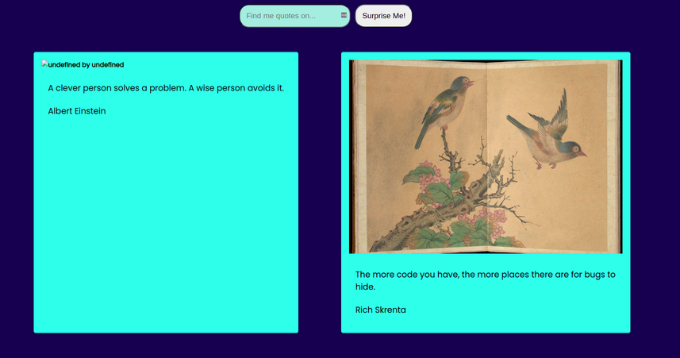

# ART OF CODE
Art of code is an essential website for anyone with a passion for programming and art.
Navigate through our easy-to-use website for your daily dose of coding inspiration. 

The app  queries two APIs and uses the results to update the DOM. The user can search, filter the content to affect what is displayed. 

## How it works:
Users will either type in an input and search or generate random results  
If user inputs something then a programming quote with the users input will be displayed , otherwise the quotes will be generated randomly  
Results will be displayed in card-form => which include art images and quotes beneath them
  

## User Stories
> A user story is a description of one or more features of a piece of software.

### Accomplished user stories:  
### As a user :  

- I can get random results or search for particular ones
- I can view the app on all of my devices
- I can see the results from both APIs displayed in one card
- I can use the keyboard to navigate through the entire website
- I am automatically scrolled to the section of the page where the results have been displayed

## Stretch stories
- As an impatient user, I want to see some indication that data is loading
- As a confused user, I want to be told when something goes wrong

## Accomplishments :
### UX/UI :
- The app has unique user interface features like:
    - Card light up on hover
    - The search bar lights up on hover
    - The user is automatically scrolled to the section where the new card has been displayed
- The team have used BEM methodology to name their selectors
- The webapp is accessible to all users
- The website can be viewed easily on all devices

### Deployment
- The app is hosted on [Nelify](https://www.netlify.com/)    

### API
- The two APIs used were:
    - [Programming quotes](https://programming-quotes-api.herokuapp.com/)
    - [Harvard arts API](https://www.harvardartmuseums.org/collections/api)

## Challenges:
1. First card was displayed without an image

  

### Solution :
This occured because the the function that was fetching the results from the images API ran before the one displaying results  
To fix this we ran the quotes and results-displaying function within the Images API function

## Team
- [Jihyun](https://github.com/Jihyun-Jang) - Scrum Master
- [Trish](https://github.com/trishtracking) - Quality Control Specialist
- [Aishah](https://github.com/aissshah) - Deployment Specialist
- [Khadija](https://github.com/khadija-nur) - Design Specialist